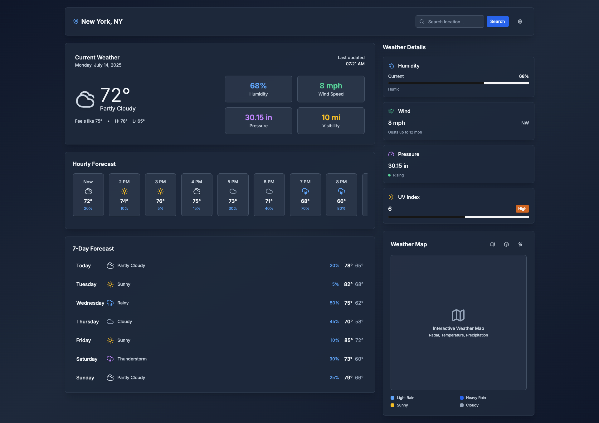

# Weather Dashboard 🌦️

A modern, responsive weather dashboard built with Next.js, React, and TypeScript. Get real-time weather information with an intuitive and beautiful interface.


*Modern weather dashboard with hourly forecasts, weekly outlook, and detailed metrics*

## ✨ Features

- **Real-time Weather Data**: Current weather conditions with temperature, feels-like, and weather descriptions
- **Location Search**: Search and select different cities and locations
- **Hourly Forecast**: Detailed 10-hour weather forecast with precipitation chances
- **7-Day Weekly Forecast**: Extended weather outlook for the week ahead
- **Weather Metrics**: Comprehensive weather data including:
  - Humidity levels
  - Wind speed and direction
  - Atmospheric pressure with trends
  - UV Index
  - Visibility
- **Interactive Weather Map**: Visual representation of weather conditions
- **Responsive Design**: Optimized for desktop, tablet, and mobile devices
- **Modern UI**: Clean, gradient design with smooth animations
- **Dark Theme**: Easy-on-the-eyes dark interface

## 🚀 Tech Stack

- **Framework**: [Next.js 15](https://nextjs.org/) with App Router
- **Language**: [TypeScript](https://www.typescriptlang.org/)
- **UI Library**: [React 19](https://react.dev/)
- **Styling**: [Tailwind CSS](https://tailwindcss.com/)
- **UI Components**: [shadcn/ui](https://ui.shadcn.com/) with Radix UI primitives
- **Icons**: [Lucide React](https://lucide.dev/)
- **Charts**: [Recharts](https://recharts.org/)
- **Date Handling**: [date-fns](https://date-fns.org/)
- **Form Handling**: [React Hook Form](https://react-hook-form.com/) with Zod validation

## 📦 Installation

1. **Clone the repository**
   ```bash
   git clone https://github.com/apLanka/weather-dashbaord
   cd weather-dashboard
   ```

2. **Install dependencies**
   ```bash
   # Using yarn (recommended)
   yarn install
   
   # Using npm
   npm install
   
   # Using pnpm
   pnpm install
   ```

3. **Run the development server**
   ```bash
   # Using yarn
   yarn dev
   
   # Using npm
   npm run dev
   
   # Using pnpm
   pnpm dev
   ```

4. **Open your browser**
   Navigate to [http://localhost:3000](http://localhost:3000) to see the application.

## 🌟 Usage

### Basic Usage
1. **View Current Weather**: The dashboard displays current weather conditions for the default location (New York, NY)
2. **Search Locations**: Use the search bar in the header to find weather for different cities
3. **Explore Forecasts**: Scroll through hourly and weekly forecasts
4. **Check Metrics**: View detailed weather metrics in the right sidebar

### Location Search
- Type a city name in the search bar
- Select from location suggestions (when integrated with a weather API)
- The dashboard will update to show weather for the selected location

## 📁 Project Structure

```
weather-dashboard/
├── app/                    # Next.js App Router
│   ├── globals.css        # Global styles
│   ├── layout.tsx         # Root layout
│   └── page.tsx           # Main dashboard page
├── components/
│   ├── ui/                # shadcn/ui components
│   │   ├── button.tsx     # Button component
│   │   ├── card.tsx       # Card component
│   │   ├── input.tsx      # Input component
│   │   └── ...            # Other UI components
│   └── weather/           # Weather-specific components
│       ├── CurrentWeather.tsx     # Current conditions display
│       ├── HourlyForecast.tsx     # Hourly forecast component
│       ├── WeatherHeader.tsx      # Header with search
│       ├── WeatherIcon.tsx        # Weather condition icons
│       ├── WeatherMap.tsx         # Interactive weather map
│       ├── WeatherMetrics.tsx     # Detailed metrics panel
│       └── WeeklyForecast.tsx     # 7-day forecast
├── hooks/                 # Custom React hooks
│   └── use-toast.ts      # Toast notification hook
├── lib/                   # Utility functions and data
│   ├── utils.ts          # General utilities
│   └── weatherData.ts    # Weather data types and mock data
├── components.json        # shadcn/ui configuration
├── next.config.js         # Next.js configuration
├── package.json           # Dependencies and scripts
├── tailwind.config.ts     # Tailwind CSS configuration
├── tsconfig.json          # TypeScript configuration
└── yarn.lock             # Yarn lockfile
```

## 🔧 Development

### Available Scripts

- `yarn dev` - Start development server
- `yarn build` - Build for production
- `yarn start` - Start production server
- `yarn lint` - Run ESLint

### Customization

- **Colors**: Modify the gradient and color scheme in `app/globals.css` and Tailwind config
- **Layout**: Adjust the grid layout in `app/page.tsx`
- **Components**: Add new weather widgets in `components/weather/`
- **Animations**: Enhance with Framer Motion or other animation libraries

## 🚀 Deployment

### Vercel
1. Push your code to GitHub
2. Connect your repository to [Vercel](https://vercel.com)
3. Add environment variables in Vercel dashboard
4. Deploy with zero configuration

## 🎨 Design Features

- **Gradient Background**: Beautiful slate gradient from dark to darker
- **Glass Morphism**: Semi-transparent cards with backdrop blur
- **Responsive Grid**: Adaptive layout for different screen sizes
- **Modern Typography**: Clean, readable fonts with proper hierarchy
- **Smooth Transitions**: CSS animations for better user experience
- **Accessible Colors**: High contrast ratios for better accessibility

## 🙏 Acknowledgments

- [shadcn/ui](https://ui.shadcn.com/) for the beautiful UI components
- [Lucide](https://lucide.dev/) for the clean icons
- [Tailwind CSS](https://tailwindcss.com/) for the utility-first CSS framework
- [Radix UI](https://www.radix-ui.com/) for accessible component primitives
- [Next.js](https://nextjs.org/) for the amazing React framework
- Weather data providers for inspiration